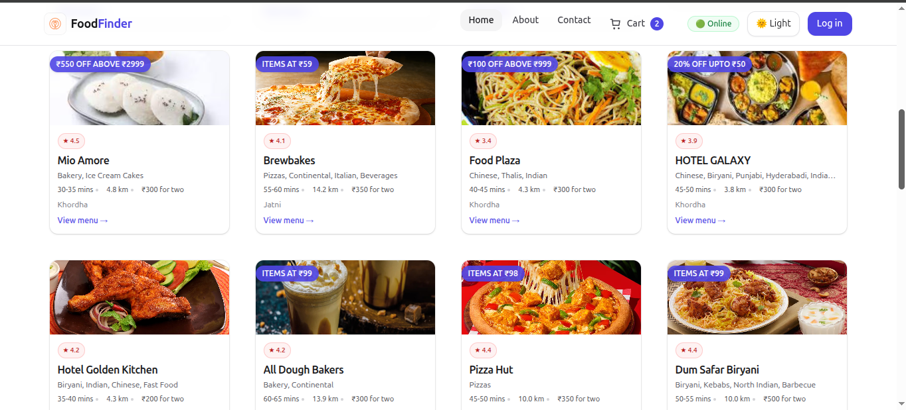
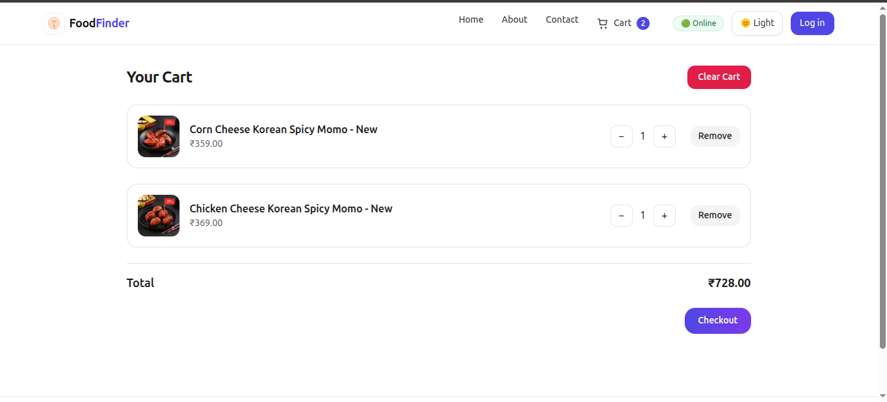
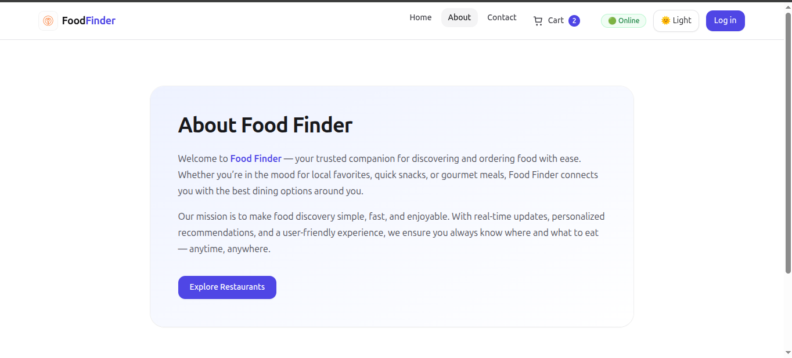

# 🍴 Food Finder  

A modern **food discovery web application** built with **React**, **Tailwind CSS**, **Redux Toolkit**, and **Swiggy’s Live API**. This project demonstrates my ability to build production-ready frontend applications from scratch, covering **state management, API integration, UI/UX design, and testing**.  

🚀 **Live Demo:** [Food Finder on Vercel](https://food-finder-omega.vercel.app/)  
⚠️ *Note:* Since the app fetches live Swiggy API data, you’ll need to enable a [CORS browser extension](https://chromewebstore.google.com/detail/allow-cors-access-control/lhobafahddgcelffkeicbaginigeejlf?hl=en) to run it properly.  

---

## 📸 Screenshots  

### Homepage  
  

### Cart  
  

### About 
  

### Contact 
 

---

## ✨ Features  

✅ **React Project Setup from Scratch** – Configured project without boilerplates.  
✅ **Deep Dive into JSX & React Core Concepts** – Clean reusable components.  
✅ **Tailwind CSS Integration** – Modern, responsive UI with utility-first styling.  
✅ **React Hooks** – Implemented `useState`, `useEffect`, `useReducer`, `useContext`, and custom hooks.  
✅ **React Router** – Client-side navigation for Home, About, Contact, Cart, and Restaurant pages.  
✅ **Live API Integration** – Fetching real-time restaurant data from Swiggy APIs.  
✅ **Redux & Redux Toolkit** – State management for authentication, cart, and filters.  
✅ **Authentication Workflow** – Login/Logout button handled via Redux state.  
✅ **Testing with Jest** – Unit and integration tests for core components.  
✅ **Performance Optimizations** – Implemented lazy loading, code-splitting, and memoization.  
✅ **Deployed on Vercel** – Production-ready hosting.  

---

## 🏗️ Project Structure  

```plaintext
src/
 ┣ tests/              # Jest test cases
 ┣ components/         # Reusable React components
 ┣ mock/               # Mock data for testing
 ┣ src-utils/          # Utility functions & hooks
 ┃ ┗ hooks/            # Custom React hooks
 ┣ app.js              # Root app
 ┣ setupTests.js       # Jest setup
 ┗ index.html / css    # Entry point


---

## ⚙️ Tech Stack  

- **Frontend Framework:** React (Functional Components)  
- **Styling:** Tailwind CSS  
- **State Management:** Redux + Redux Toolkit  
- **Routing:** React Router  
- **Testing:** Jest  
- **Deployment:** Vercel  
- **API:** Swiggy Live API  

---

## 🧪 Testing  

The app includes **unit and integration tests** for components like:  
- `Cart`  
- `Header`  
- `SearchBar`  
- `RestaurantCard`  

## 🚀 Getting Started  

Follow these steps to run the project locally:  

### 1️⃣ Clone the repository and install dependencies  

```bash
git clone https://github.com/your-username/food-finder.git
cd food-finder
npm install

2️⃣ Run development server
npm start

3️⃣ Run tests
npm test

4️⃣ Build for production
npm run build


👨‍💻 Developed By

Arpon Roy – Frontend Developer

🔗 LinkedIn

🐙 GitHub